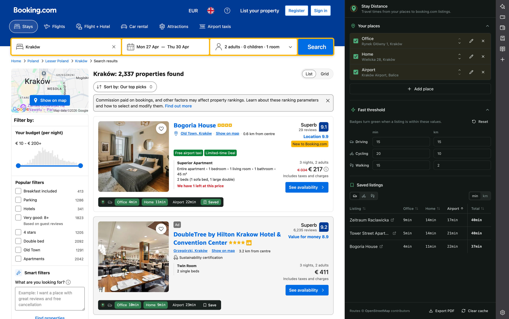

<p align="center">
  
</p>

<h1 align="center">Stay Distance</h1>

Open-source Chrome/Edge extension that overlays **driving, cycling, and walking times** from your saved places onto **booking.com** listings. Privacy-first: all data stays on your device; routing uses the free public OpenStreetMap stack (Nominatim + OSRM).

<p align="center">
  
</p>

<p align="center"><em>Each booking.com listing gets inline travel times from your saved places (Office, Home, Airport…). The side panel manages origins and shows a full matrix across your saved listings.</em></p>

See [`docs/BRANDING.md`](docs/BRANDING.md) for the icon/theme guide.

Airbnb and other platforms are planned — the architecture is platform-agnostic so adding a new site is one adapter file.

## Features

### On booking.com

- **Inline travel-time badges** on every property card — one badge per saved origin, showing duration (or distance) for the active transport mode. Badges turn **green** when the route is within your configured "fast threshold", so good matches pop out at a glance.
- **Driving / cycling / walking** — switch transport mode from the popup, side panel, or matrix view; all badges and the matrix re-calculate.
- **Save listings** with a one-click bookmark on each card. Saved listings feed the matrix view and the PDF export.
- **Detail-page support** — the overlay also appears on individual hotel pages, not just search results.

### Side panel

- **Origin manager** — add, edit, rename, reorder, and toggle up to 10 places (Home, Office, Airport, kid's school…). Addresses are geocoded via Nominatim and cached locally.
- **Matrix view** — a sortable table of every saved listing × every active origin, with row totals. Sort by any origin, by total, or by title; switch the whole matrix between minutes and kilometres.
- **Fast thresholds** — separate duration and distance thresholds per transport mode. Reset to defaults with one click.
- **Export to PDF** — generates a shareable report of your shortlist with routes for all transport modes. See a [sample report](docs/sample-report.pdf).
- **Clear cache** button for when you've fixed a typo in an address or just want a fresh fetch.

### Popup (quick controls)

Toggle which origins are active, switch transport mode, and show/hide the inline badges without opening the side panel.

### Privacy & data

- **100% local** — origins, saved listings, settings, and the geocode/route caches live only in `chrome.storage.local`. No account, no sync, no telemetry.
- **Free OpenStreetMap stack** — addresses go to [Nominatim](https://nominatim.openstreetmap.org), routes to [OSRM](https://routing.openstreetmap.de). Host permissions are restricted to those two domains plus `booking.com`.
- **Offline mode** flag disables all network calls; the extension then serves whatever is already cached.
- **HTTPS-only** — URLs and image sources pulled from the DOM are validated before being stored or rendered, so no `javascript:` / `data:` sneaks through.

### Platform-agnostic architecture

Each site is a single adapter (`matchUrl`, `detectListings`, `extractListing`, `getInjectionPoint`, `getDetailPageListing`) — see [`docs/ADDING_A_PLATFORM.md`](docs/ADDING_A_PLATFORM.md). Airbnb and others are planned.

## Status

Phase 1 — **architectural skeleton**. Platform-specific DOM selectors and extractors for booking.com are stubs (`src/platforms/booking/`); wire-up to the live DOM happens in Phase 2.

## Install (no coding required)

If you just want to use the extension, you don't need to build anything. A ready-to-use build is attached to every release.

### 1. Download the latest build

Go to the [**Releases** page](https://github.com/doryski/stay-distance/releases/latest) and download the `stay-distance-vX.Y.Z.zip` file under **Assets**.

### 2. Unzip it

Unzip the file somewhere you'll remember (e.g. your Desktop). You'll get a folder containing the built extension. **Do not delete this folder** — your browser loads the extension directly from it.

### 3. Load it into your browser

1. Open your browser and go to:
   - Chrome: `chrome://extensions`
   - Edge: `edge://extensions`
   - Brave: `brave://extensions`
2. Turn on **Developer mode** (toggle in the top-right corner).
3. Click **Load unpacked**.
4. Select the folder you unzipped in step 2.

The Stay Distance icon should now appear in your browser's toolbar. Visit a booking.com listing to see travel times from your saved places.

### Updating later

When a new release is published, download the new ZIP, replace the old folder with the new one, and click the **refresh** icon on the extension's card in `chrome://extensions`. Your saved origins and settings stay in the browser, so nothing is lost.

> **Why Developer mode?** The extension isn't published on the Chrome Web Store yet, so browsers require Developer mode to load it from a folder. This is normal and safe — the source code is right here in this repository for anyone to inspect.

---

## For developers

```bash
pnpm install
pnpm build
```

Load `dist/` as an unpacked extension in `chrome://extensions` (Developer mode → Load unpacked).

Dev mode (HMR):

```bash
pnpm dev
```

## Tests

```bash
pnpm test
```

## Architecture

See [`docs/ARCHITECTURE.md`](docs/ARCHITECTURE.md) and [`docs/ADDING_A_PLATFORM.md`](docs/ADDING_A_PLATFORM.md).

## Privacy

See [`docs/PRIVACY.md`](docs/PRIVACY.md). No telemetry. Origins, saved listings, and geocode/route caches live only in `chrome.storage.local` on your device.

## License

[MIT](LICENSE)
